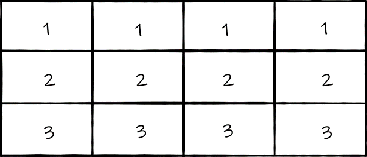

# AutoBulb Project
## Overview
The goal of this project is to be able to spotlight a subject in a video stream. Here, *"spotlight"* literally means to shine a *physical room light* on the subject

The project's implementation is based on 3 parts:
1. Detect a "warm" body in an image. This includes humans, dogs, cats, etc.
2. Map the detected body in the image to the subjects' positions in the room
3. Based on the subjects' positions in the room, turn on the corresponding lights

### Example Scenario
Imagine a 3' by 4' room with 3 lights that are organized as follows:

In this scenario, as we move about the room (in this case, the rows), we want to be able to turn on a light if a subject is in its zone. e.g If I am standing in sector 1, I want light 1 to be on and all other lights to be off.

## Testing/Seeing for Yourself
### Current Capabilities
The first stage of this project can do the following:
- Given a set of world coordinates and their corresponding image points, create a homography between the points
  - This allows for the system to map image points to real-world points in the room.
- Given a video stream (either from web-cam or from video file), detect a human subject in a video frame
- If run on a Raspberry Pi *(this project was run on a Pi 3)*, trigger some LEDs that represent a room's light layout.

### How to Test
If running on a Pi... leave the code as is. If not, comment out any instances of `lm` in the `main`, as this is a hardware interface that will communicate with the GPIO pins on a Pi.

## Requirements
### Software
This project is built using the following software tools
- Python 3
- [OpenCV](opencv.org) (4.4.0.46 as of this commit)
- NumPy

### Parts
There is a hardware component to this project to manage physical lighting. Anything marked with an `*` implies that the type or number of the part does not matter for the project. However, if you do decide to change things up during testing, make sure to supply the relevant configuration in [`driver.py`](driver.py).
- Raspberry Pi 3
- LED(s) (3 for use with [`ryan_video.mp4`](resources/ryan_video.mp4))
- Bidirectional Resistors
  - 1 per LED or maybe not, if the LED doesn't need it...

## Resources/Credits
- `TODO: Add resources and credits`